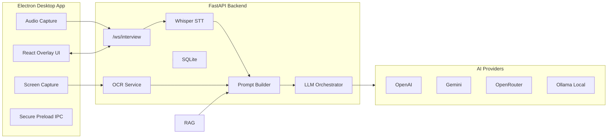

# AI Answer Assistant Overlay


A production-oriented desktop AI assistant for live interviews. It combines an Electron transparent overlay, real-time microphone streaming, FastAPI WebSockets, Whisper transcription, OCR screen context, streaming LLM answers, and a fully-local RAG pipeline that grounds answers in your own documents.

> Screenshot placeholders  
> `docs/screenshots/overlay-expanded.png`  
> `docs/screenshots/passive-listening.png`  
> `docs/screenshots/settings.png`

## Features

- Transparent, frameless, always-on-top Electron overlay
- Expanded, passive, and invisible overlay modes
- Global hotkeys for visibility, listening, click-through, and screenshots
- Real-time WebSocket pipeline for audio, transcripts, and AI deltas
- Faster Whisper integration for low-latency transcription
- OpenAI, Gemini, OpenRouter, and Ollama provider abstraction
- Local-first mode with Ollama and local Whisper
- OCR screen-context capture via Electron `desktopCapturer` and Tesseract
- **RAG (Retrieval-Augmented Generation):** upload PDF, DOCX, or XLSX files and receive answers grounded in your documents with inline citations
- Secure Electron preload with `contextIsolation`, sandboxing, and disabled renderer Node access
- Optional shared-secret auth for REST and WebSocket traffic
- SQLite persistence for sessions, transcripts, settings, and prompts
- Docker, CI, linting, tests, and packaging configuration

## Architecture



**RAG pipeline (when documents are indexed):**

```
Document upload (PDF/DOCX/XLSX)
  └─ loaders   → raw text + metadata (source, page)
  └─ chunker   → overlapping ~800-char chunks
  └─ embeddings → float vectors via nomic-embed-text (Ollama)
  └─ ChromaDB  → persisted to local-rag/storage/

Question (audio or typed)
  └─ embeddings → query vector (same model)
  └─ ChromaDB  → top-k nearest chunks (cosine similarity)
  └─ prompt    → system prompt + labeled excerpts injected
  └─ Ollama    → streaming answer with [source, page] citations
```

## Tech Stack

- Desktop: Electron, React, TypeScript, Vite, TailwindCSS, Zustand, Framer Motion
- Backend: Python 3.11, FastAPI, WebSockets, Pydantic, AsyncIO, SQLAlchemy
- AI: OpenAI SDK, Gemini REST, OpenRouter, Ollama
- STT/OCR: faster-whisper, Tesseract OCR
- RAG: ChromaDB, nomic-embed-text, LangChain text splitters, pdfplumber, python-docx, pandas
- Testing: Vitest, Playwright-ready config, Pytest
- Packaging: Electron Builder, Docker Compose

## Installation

Requirements:

- Node.js 20+
- Python 3.11+
- Tesseract OCR
- FFmpeg
- Ollama — [https://ollama.com](https://ollama.com) (required for RAG and local LLM mode)

**Windows one-shot setup:**

```powershell
.\scripts\setup.ps1
```

**Manual setup:**

```powershell
npm install
python -m venv .venv
.venv\Scripts\activate
python -m pip install -r apps\backend\requirements.txt
copy .env.example .env
```

For deterministic backend installs, use the generated lock file:

```powershell
python -m pip install -r apps\backend\requirements.lock
```

**RAG dependencies** (install once after the above):

```powershell
python -m pip install -r local-rag\requirements.txt
```

## Development Setup

The backend requires the Python virtual environment to be **activated** before running so that `uvicorn` and all dependencies are on `PATH`.

**Step 1 — activate the venv (once per terminal session):**

```powershell
.venv\Scripts\activate
```

Your prompt will change to show `(.venv)`.

**Step 2 — start the backend:**

```powershell
npm run backend:dev
```

**Step 3 — start the Electron app** (in a second terminal, no venv needed):

Start the Vite renderer only (UI iteration, port 5173):

```powershell
npm run dev --workspace @interview/desktop
```

Start the full Electron desktop app (builds Electron main and launches the app):

```powershell
npm run electron:dev --workspace @interview/desktop
```

For UI-only work, use the Vite renderer. Use `electron:dev` when you need IPC, global shortcuts, or overlay behaviour.

## Backend Setup

Backend source lives in `apps/backend`.

Important endpoints:

- `GET /health`
- `GET /api/models`
- `POST /api/settings`
- `POST /api/ocr`
- `POST /api/session/start`
- `POST /api/session/end`
- `POST /api/documents/upload` — ingest a document file into the RAG store
- `GET /api/documents` — list indexed files and chunk count
- `POST /api/documents/reset` — clear the RAG vector store
- `WS /ws/interview`

Run tests:

```powershell
# Backend tests
.venv\Scripts\python.exe -m pytest apps\backend\tests -v

# RAG tests (no Ollama required — uses mocks)
.venv\Scripts\python.exe -m pytest local-rag\tests\ -v
```

## Frontend Setup

Desktop source lives in `apps/desktop`.

Run tests:

```bash
npm run test --workspace @interview/desktop
```

Build:

```bash
npm run build --workspace @interview/desktop
```

## Whisper Setup

Set the model in `.env`:

```env
WHISPER_MODEL=base
```

Supported values include `tiny`, `base`, `medium`, and `large-v3`. Larger models improve accuracy but increase memory and latency. For CPU-only systems, start with `base`.

## Ollama Setup

Install Ollama from [https://ollama.com](https://ollama.com), then pull the required models:

```powershell
# LLM for answers (interview assistant + RAG generation)
ollama pull llama3.1:8b

# Embedding model for RAG (must match the model used at index time)
ollama pull nomic-embed-text

# Start the Ollama server (runs in background after install on most systems)
ollama serve
```

**On 16 GB RAM (CPU-only):** `llama3.1:8b` works but generation takes 30–60 s per answer.  
Use `llama3.2:3b` for faster responses: set `RAG_LLM_MODEL=llama3.2:3b` in `.env`.

Set in `.env` for local-only mode:

```env
DEFAULT_PROVIDER=ollama
DEFAULT_MODEL=llama3.1:8b
OLLAMA_HOST=http://localhost:11434
LOCAL_ONLY=true
```

## RAG Setup

RAG lets you upload your own documents and receive answers grounded in them with source citations. The vector store persists to `local-rag/storage/` automatically — no separate database needed.

### 1. Install RAG dependencies

```powershell
python -m pip install -r local-rag\requirements.txt
```

### 2. Pull Ollama embedding model

```powershell
ollama pull nomic-embed-text
```

### 3. Ingest documents

**Via CLI:**

```powershell
# Ingest a single file
.venv\Scripts\python.exe local-rag\cli.py ingest path\to\your\document.pdf

# Ingest an entire folder (PDF, DOCX, XLSX, TXT, MD)
.venv\Scripts\python.exe local-rag\cli.py ingest path\to\your\documents\

# Check what's indexed
.venv\Scripts\python.exe local-rag\cli.py status

# Clear all indexed documents
.venv\Scripts\python.exe local-rag\cli.py reset
```

**Via Streamlit web UI** (standalone, separate from the Electron app):

```powershell
.venv\Scripts\python.exe -m streamlit run local-rag\web.py
```

Opens at `http://localhost:8501`. Upload files from the sidebar, chat in the main area, expand "Sources" to inspect retrieved chunks.

**Via Electron app Settings tab:**

With the backend running, open the Settings tab in the overlay, upload a file using the "Upload PDF / DOCX / XLSX" button, and start asking questions.

### 4. Ask questions

Once documents are indexed, every question asked in the overlay (audio or typed) is automatically answered from your documents with citations. If no relevant chunks are found, the assistant falls back to direct LLM knowledge.

Example answer with citations:
```
What is RAG?

RAG (Retrieval-Augmented Generation) is an AI pattern that grounds large language model
answers in retrieved documents [sample.md, page 1]. It reduces hallucinations and enables
citable answers without retraining the model [sample.md, page 1].
```

### RAG configuration (`.env`)

| Variable | Default | Purpose |
|----------|---------|---------|
| `RAG_ENABLED` | `true` | Set `false` to disable RAG without removing packages |
| `RAG_CHROMA_PATH` | `./local-rag/storage` | ChromaDB persistence directory |
| `RAG_COLLECTION_NAME` | `documents` | ChromaDB collection name |
| `RAG_EMBED_MODEL` | `nomic-embed-text` | Ollama embedding model (must match at ingest + query time) |
| `RAG_LLM_MODEL` | `llama3.1:8b` | Ollama model for RAG generation |
| `RAG_CHUNK_SIZE` | `800` | Target chars per chunk (~200 tokens) |
| `RAG_CHUNK_OVERLAP` | `120` | Overlap chars between chunks |
| `RAG_TOP_K` | `4` | Chunks retrieved per query |
| `RAG_DISTANCE_THRESHOLD` | `1.4` | Cosine distance cutoff (0=identical, 2=opposite) |
| `RAG_TEMPERATURE` | `0.2` | LLM temperature for RAG answers (low = grounded) |

### RAG API endpoints

| Method | Path | Purpose |
|--------|------|---------|
| `POST` | `/api/documents/upload` | Upload and ingest a file (multipart form) |
| `GET` | `/api/documents` | List indexed filenames and total chunk count |
| `POST` | `/api/documents/reset` | Delete all indexed documents |

### RAG tests

```powershell
# Run RAG unit tests (mocks Ollama — no server required)
.venv\Scripts\python.exe -m pytest local-rag\tests\ -v
```

## Docker Setup

Backend only:

```bash
docker compose up --build
```

The backend is available at `http://localhost:8000`. Docker Compose reads `.env`; copy `.env.example` to `.env` before starting. For local Ollama from Docker, keep `OLLAMA_HOST=http://host.docker.internal:11434`.

## Electron Packaging

Package installers with Electron Builder:

```bash
npm run desktop:package
```

Targets:

- Windows: NSIS installer
- macOS: DMG
- Linux: AppImage

## Keyboard Shortcuts

- `Ctrl/Cmd+Shift+Space`: toggle overlay visibility
- `Ctrl/Cmd+Shift+L`: start or stop listening
- `Ctrl/Cmd+Shift+S`: capture screen context
- `Ctrl/Cmd+Shift+X`: toggle click-through mode
- `Ctrl/Cmd+Shift+P`: toggle screen-capture protection (hides overlay from recordings on Windows 11)

## Environment Variables

| Variable | Default | Purpose |
| --- | --- | --- |
| `OPENAI_API_KEY` | — | OpenAI API key |
| `GEMINI_API_KEY` | — | Gemini API key |
| `OPENROUTER_API_KEY` | — | OpenRouter API key |
| `OLLAMA_HOST` | `http://localhost:11434` | Ollama base URL |
| `DEFAULT_PROVIDER` | `ollama` | `openai`, `gemini`, `openrouter`, or `ollama` |
| `DEFAULT_MODEL` | `llama3` | Default model id |
| `WHISPER_MODEL` | `base` | faster-whisper model size (`tiny`/`base`/`medium`/`large-v3`) |
| `LOCAL_ONLY` | `false` | Blocks cloud providers when `true` |
| `TRANSCRIPT_PERSISTENCE` | `false` | Stores transcripts in SQLite when `true` |
| `TRANSCRIPT_CONTEXT_SEGMENTS` | `60` | Rolling transcript window fed into prompts |
| `INTERVIEW_AUTH_TOKEN` | — | Optional backend shared secret for REST/WebSocket access |
| `PRELOAD_WHISPER_MODEL` | `false` | Eagerly loads Whisper at startup |
| `STT_SILENCE_FRAMES` | `2` | Trailing silence frames before utterance flush (×250 ms each) |
| `STT_PARTIAL_TRIGGER_SECONDS` | `2.0` | Speech duration before mid-utterance partial transcription fires |
| `STT_PARTIAL_COOLDOWN_SECONDS` | `1.5` | Minimum gap between consecutive partial transcriptions |
| `RAG_ENABLED` | `true` | Enable/disable RAG retrieval |
| `RAG_CHROMA_PATH` | `./local-rag/storage` | ChromaDB persistence directory |
| `RAG_COLLECTION_NAME` | `documents` | ChromaDB collection name |
| `RAG_EMBED_MODEL` | `nomic-embed-text` | Ollama embedding model |
| `RAG_LLM_MODEL` | `llama3.1:8b` | Ollama model for RAG generation |
| `RAG_CHUNK_SIZE` | `800` | Target chars per chunk |
| `RAG_CHUNK_OVERLAP` | `120` | Overlap chars between chunks |
| `RAG_TOP_K` | `4` | Chunks retrieved per query |
| `RAG_DISTANCE_THRESHOLD` | `1.4` | Cosine distance cutoff (chunks above this are dropped) |
| `RAG_TEMPERATURE` | `0.2` | LLM temperature for RAG answers |
| `VITE_BACKEND_URL` | `http://localhost:8000` | Renderer REST backend URL |
| `VITE_WS_URL` | `ws://localhost:8000/ws/interview` | Renderer WebSocket URL |
| `VITE_BACKEND_TOKEN` | — | Renderer token matching `INTERVIEW_AUTH_TOKEN` |

## Troubleshooting

**General**
- Microphone permission denied: allow microphone access for the Electron app in OS privacy settings.
- Ollama connection fails: confirm `ollama serve` is running and `OLLAMA_HOST` in `.env` matches.
- Whisper is slow: use `tiny` or `base`, close other CPU-heavy apps, or run on a GPU-enabled machine.
- OCR returns empty text: install Tesseract and verify it is on `PATH`.
- Overlay cannot be clicked: press `Ctrl/Cmd+Shift+X` to disable click-through.

**RAG**
- Answers not grounded in documents → check ingestion ran: `python local-rag/cli.py status` must show > 0 chunks.
- `Cannot reach Ollama` during ingest or query → run `ollama serve` and confirm `OLLAMA_HOST` is correct.
- `Model not found` during embed → run `ollama pull nomic-embed-text`.
- `Model not found` during generation → run `ollama pull llama3.1:8b`.
- RAG disabled (Settings tab shows "not available") → install deps: `python -m pip install -r local-rag\requirements.txt` and ensure `RAG_ENABLED=true` in `.env`.
- Answers seem generic (not from documents) → lower `RAG_DISTANCE_THRESHOLD` in `.env` (e.g. `1.2`) to tighten relevance filtering; check that ingestion printed added chunks.
- Slow responses on 16 GB RAM → set `RAG_LLM_MODEL=llama3.2:3b` and `RAG_TOP_K=2` in `.env`.
- Excel rows not matching → rename columns in Excel before ingesting; the loader serialises each row as `"Sheet <name> | ColName: val"` so generic column names (`A`, `B`) embed poorly.
- Empty PDF text (scanned PDF) → scanned PDFs contain images, not text. Use a native-text PDF or export to DOCX. OCR ingestion is out of scope for Phase 1.

## Security Considerations

- API keys are read from backend environment variables and are never hardcoded in the renderer.
- Electron uses `contextIsolation`, a sandboxed renderer, disabled `nodeIntegration`, and a narrow preload API.
- Electron injects a Content Security Policy for renderer pages.
- Set `INTERVIEW_AUTH_TOKEN` and matching `VITE_BACKEND_TOKEN` when binding the backend beyond loopback.
- Local-only mode prevents cloud provider calls.
- Transcript persistence is opt-in through `TRANSCRIPT_PERSISTENCE`.
- Logs are structured and rotated by Loguru on the backend.

## Performance Tuning

- Use 1-2 second audio chunks for balanced latency and accuracy.
- Prefer `base` Whisper for CPU machines and larger models only where latency allows.
- Use Ollama models that fit memory comfortably.
- Keep the overlay in passive mode during long sessions to reduce renderer work.
- Disable transcript persistence for maximum privacy and lower disk I/O.

## FAQ

**Is system audio capture complete on every OS?**  
The architecture isolates system audio capture behind the Electron audio service. Microphone capture works through browser media APIs; WASAPI loopback, BlackHole, and PulseAudio can be added behind that service without changing the backend protocol.

**Can it run without cloud APIs?**  
Yes. Use Ollama plus local Whisper and set `LOCAL_ONLY=true`.

**Does it store transcripts?**  
Only when `TRANSCRIPT_PERSISTENCE=true`.

**Can I use it for coding interviews?**  
Yes. The prompt builder has interview, coding, and system design modes, and the UI can send manual coding questions or OCR screen context.

## Contribution Guide

1. Create a branch with the `codex/` prefix.
2. Run backend and desktop tests before opening a pull request.
3. Keep provider-specific logic isolated in backend services.
4. Keep Electron renderer code free of direct Node APIs.
5. Document new environment variables in `.env.example` and this README.

## License

MIT. Replace this placeholder with your organization’s final license text before distribution.
