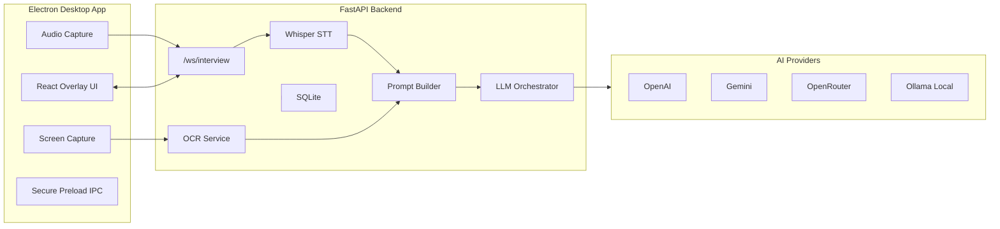

# AI Answer Assistant Overlay


A production-oriented desktop AI assistant for live interviews. It combines an Electron transparent overlay, real-time microphone streaming, FastAPI WebSockets, Whisper transcription, OCR screen context, and streaming LLM answers through OpenAI, Gemini, OpenRouter, or local Ollama.

> Screenshot placeholders  
> `docs/screenshots/overlay-expanded.png`  
> `docs/screenshots/passive-listening.png`  
> `docs/screenshots/settings.png`

## Features

- Transparent, frameless, always-on-top Electron overlay
- Expanded, passive, and invisible overlay modes
- Global hotkeys for visibility, listening, click-through, and screenshots
- Real-time WebSocket pipeline for audio, transcripts, and AI deltas
- Faster Whisper integration for low-latency transcription
- OpenAI, Gemini, OpenRouter, and Ollama provider abstraction
- Local-first mode with Ollama and local Whisper
- OCR screen-context capture via Electron `desktopCapturer` and Tesseract
- Secure Electron preload with `contextIsolation`, sandboxing, and disabled renderer Node access
- Optional shared-secret auth for REST and WebSocket traffic
- SQLite persistence for sessions, transcripts, settings, and prompts
- Docker, CI, linting, tests, and packaging configuration

## Architecture



## Tech Stack

- Desktop: Electron, React, TypeScript, Vite, TailwindCSS, Zustand, Framer Motion
- Backend: Python 3.11, FastAPI, WebSockets, Pydantic, AsyncIO, SQLAlchemy
- AI: OpenAI SDK, Gemini REST, OpenRouter, Ollama
- STT/OCR: faster-whisper, Tesseract OCR
- Testing: Vitest, Playwright-ready config, Pytest
- Packaging: Electron Builder, Docker Compose

## Installation

Requirements:

- Node.js 20+
- Python 3.11+
- Tesseract OCR
- FFmpeg
- Optional: Ollama for local LLM mode

Windows setup:

```powershell
.\scripts\setup.ps1
```

Manual setup:

```powershell
npm install
python -m venv .venv
.venv\Scripts\activate
pip install -r apps\backend\requirements.txt
copy .env.example .env
```

For deterministic backend installs, use the generated lock file:

```powershell
pip install -r apps\backend\requirements.lock
```

## Development Setup

The backend requires the Python virtual environment to be **activated** before running so that `uvicorn` and all dependencies are on `PATH`.

**Step 1 — activate the venv (once per terminal session):**

```powershell
.venv\Scripts\activate
```

Your prompt will change to show `(.venv)`.

**Step 2 — start the backend:**

```powershell
npm run backend:dev
```

**Step 3 — start the Electron app** (in a second terminal, no venv needed):

Start the Vite renderer only (UI iteration, port 5173):

```powershell
npm run dev --workspace @interview/desktop
```

Start the full Electron desktop app (builds Electron main and launches the app):

```powershell
npm run electron:dev --workspace @interview/desktop
```

For UI-only work, use the Vite renderer. Use `electron:dev` when you need IPC, global shortcuts, or overlay behaviour.

## Backend Setup

Backend source lives in `apps/backend`.

Important endpoints:

- `GET /health`
- `GET /api/models`
- `POST /api/settings`
- `POST /api/ocr`
- `POST /api/session/start`
- `POST /api/session/end`
- `WS /ws/interview`

Run tests:

```bash
pytest apps/backend/tests
```

## Frontend Setup

Desktop source lives in `apps/desktop`.

Run tests:

```bash
npm run test --workspace @interview/desktop
```

Build:

```bash
npm run build --workspace @interview/desktop
```

## Whisper Setup

Set the model in `.env`:

```env
WHISPER_MODEL=base
```

Supported values include `tiny`, `base`, `medium`, and `large-v3`. Larger models improve accuracy but increase memory and latency. For CPU-only systems, start with `base`.

## Ollama Setup

Install Ollama, then pull a model:

```bash
ollama pull llama3
ollama serve
```

Set:

```env
DEFAULT_PROVIDER=ollama
DEFAULT_MODEL=llama3
OLLAMA_HOST=http://localhost:11435
LOCAL_ONLY=true
```

## Docker Setup

Backend only:

```bash
docker compose up --build
```

The backend is available at `http://localhost:8000`. Docker Compose reads `.env`; copy `.env.example` to `.env` before starting. For local Ollama from Docker, keep `OLLAMA_HOST=http://host.docker.internal:11434`.

## Electron Packaging

Package installers with Electron Builder:

```bash
npm run desktop:package
```

Targets:

- Windows: NSIS installer
- macOS: DMG
- Linux: AppImage

## Keyboard Shortcuts

- `Ctrl/Cmd+Shift+Space`: toggle overlay visibility
- `Ctrl/Cmd+Shift+L`: start or stop listening
- `Ctrl/Cmd+Shift+S`: capture screen context
- `Ctrl/Cmd+Shift+X`: toggle click-through mode
- `Ctrl/Cmd+Shift+P`: toggle screen-capture protection (hides overlay from recordings on Windows 11)

## Environment Variables

| Variable | Purpose |
| --- | --- |
| `OPENAI_API_KEY` | OpenAI API key |
| `GEMINI_API_KEY` | Gemini API key |
| `OPENROUTER_API_KEY` | OpenRouter API key |
| `OLLAMA_HOST` | Ollama base URL |
| `DEFAULT_PROVIDER` | `openai`, `gemini`, `openrouter`, or `ollama` |
| `DEFAULT_MODEL` | Default model id |
| `WHISPER_MODEL` | faster-whisper model size |
| `LOCAL_ONLY` | Blocks cloud providers when true |
| `TRANSCRIPT_PERSISTENCE` | Stores transcripts in SQLite when true |
| `TRANSCRIPT_CONTEXT_SEGMENTS` | Number of transcript segments retained in prompt context |
| `INTERVIEW_AUTH_TOKEN` | Optional backend shared secret for REST/WebSocket access |
| `PRELOAD_WHISPER_MODEL` | Eagerly loads Whisper at startup when true |
| `VITE_BACKEND_URL` | Renderer REST backend URL |
| `VITE_WS_URL` | Renderer WebSocket URL |
| `VITE_BACKEND_TOKEN` | Renderer token matching `INTERVIEW_AUTH_TOKEN` |

## Troubleshooting

- Microphone permission denied: allow microphone access for the Electron app in OS privacy settings.
- Ollama connection fails: confirm `ollama serve` is running and `OLLAMA_HOST` is correct.
- Whisper is slow: use `tiny` or `base`, close other CPU-heavy apps, or run on a GPU-enabled machine after adjusting the Whisper service.
- OCR returns empty text: install Tesseract and verify it is available on `PATH`.
- Overlay cannot be clicked: press `Ctrl/Cmd+Shift+X` to disable click-through.

## Security Considerations

- API keys are read from backend environment variables and are never hardcoded in the renderer.
- Electron uses `contextIsolation`, a sandboxed renderer, disabled `nodeIntegration`, and a narrow preload API.
- Electron injects a Content Security Policy for renderer pages.
- Set `INTERVIEW_AUTH_TOKEN` and matching `VITE_BACKEND_TOKEN` when binding the backend beyond loopback.
- Local-only mode prevents cloud provider calls.
- Transcript persistence is opt-in through `TRANSCRIPT_PERSISTENCE`.
- Logs are structured and rotated by Loguru on the backend.

## Performance Tuning

- Use 1-2 second audio chunks for balanced latency and accuracy.
- Prefer `base` Whisper for CPU machines and larger models only where latency allows.
- Use Ollama models that fit memory comfortably.
- Keep the overlay in passive mode during long sessions to reduce renderer work.
- Disable transcript persistence for maximum privacy and lower disk I/O.

## FAQ

**Is system audio capture complete on every OS?**  
The architecture isolates system audio capture behind the Electron audio service. Microphone capture works through browser media APIs; WASAPI loopback, BlackHole, and PulseAudio can be added behind that service without changing the backend protocol.

**Can it run without cloud APIs?**  
Yes. Use Ollama plus local Whisper and set `LOCAL_ONLY=true`.

**Does it store transcripts?**  
Only when `TRANSCRIPT_PERSISTENCE=true`.

**Can I use it for coding interviews?**  
Yes. The prompt builder has interview, coding, and system design modes, and the UI can send manual coding questions or OCR screen context.

## Contribution Guide

1. Create a branch with the `codex/` prefix.
2. Run backend and desktop tests before opening a pull request.
3. Keep provider-specific logic isolated in backend services.
4. Keep Electron renderer code free of direct Node APIs.
5. Document new environment variables in `.env.example` and this README.

## License

MIT. Replace this placeholder with your organization’s final license text before distribution.
